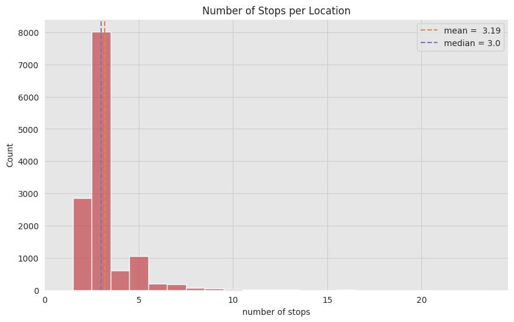
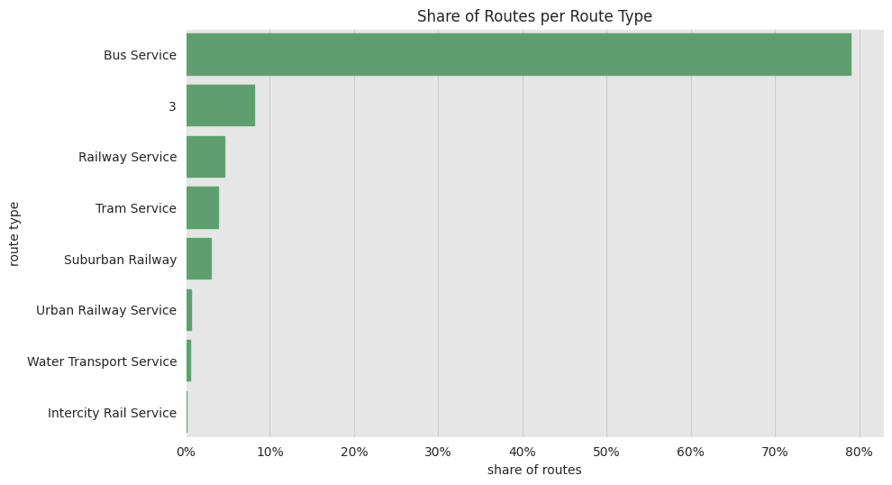
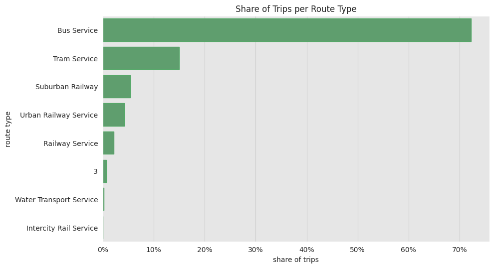
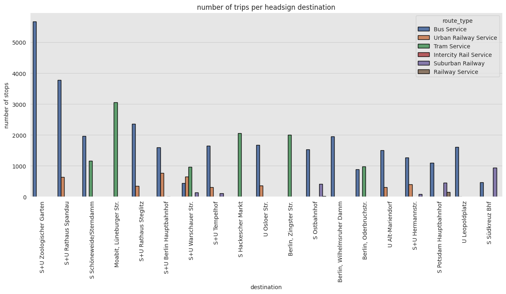

# VBB GTFS Data 

## Prepare Data
download the gtfs data, takes a good minute


```python
# https://www.vbb.de/media/download/2029
from io import BytesIO
from zipfile import ZipFile
from urllib.request import urlopen

resp = urlopen("https://www.vbb.de/media/download/2029")
%time zipfile = ZipFile(BytesIO(resp.read()))
zipfile.namelist()
```

    CPU times: user 45.1 ms, sys: 110 ms, total: 156 ms
    Wall time: 2.38 s


    ['agency.txt',
     'calendar.txt',
     'calendar_dates.txt',
     'frequencies.txt',
     'pathways.txt',
     'routes.txt',
     'shapes.txt',
     'stop_times.txt',
     'stops.txt',
     'transfers.txt',
     'trips.txt']


## Stops


```python
#import sys
#!{sys.executable} -m pip install mplleaflet
import pandas as pd
import numpy as np
import mplleaflet
%time stops_df = pd.read_csv(zipfile.open('stops.txt'))
stops_df.tail()
stops_df.info()
```

    CPU times: user 87.3 ms, sys: 4.51 ms, total: 91.8 ms
    Wall time: 91.8 ms
    <class 'pandas.core.frame.DataFrame'>
    RangeIndex: 41733 entries, 0 to 41732
    Data columns (total 11 columns):
     #   Column               Non-Null Count  Dtype  
    ---  ------               --------------  -----  
     0   stop_id              41733 non-null  object 
     1   stop_code            0 non-null      float64
     2   stop_name            41733 non-null  object 
     3   stop_desc            0 non-null      float64
     4   stop_lat             41733 non-null  float64
     5   stop_lon             41733 non-null  float64
     6   location_type        41733 non-null  int64  
     7   parent_station       28607 non-null  float64
     8   wheelchair_boarding  2944 non-null   float64
     9   platform_code        4419 non-null   object 
     10  zone_id              15336 non-null  object 
    dtypes: float64(6), int64(1), object(4)
    memory usage: 3.5+ MB


```python
stops_df.fillna('', inplace=True)
stops_df = stops_df.drop(['stop_code', 'stop_desc'], axis=1)
stops_df.loc[stops_df["wheelchair_boarding"] == '','wheelchair_boarding'] = 0
stops_df_multiple_stops = stops_df.copy()
stops_df.drop_duplicates(subset=['stop_name', 'location_type', 'wheelchair_boarding', 'platform_code'],keep='first', inplace = True)
stops_df.head()
```


<div>
<style scoped>
    .dataframe tbody tr th:only-of-type {
        vertical-align: middle;
    }

    .dataframe tbody tr th {
        vertical-align: top;
    }

    .dataframe thead th {
        text-align: right;
    }
</style>
<table border="1" class="dataframe">
  <thead>
    <tr style="text-align: right;">
      <th></th>
      <th>stop_id</th>
      <th>stop_name</th>
      <th>stop_lat</th>
      <th>stop_lon</th>
      <th>location_type</th>
      <th>parent_station</th>
      <th>wheelchair_boarding</th>
      <th>platform_code</th>
      <th>zone_id</th>
    </tr>
  </thead>
  <tbody>
    <tr>
      <th>0</th>
      <td>000008012713</td>
      <td>Rangsdorf, Bahnhof</td>
      <td>52.294125</td>
      <td>13.431112</td>
      <td>0</td>
      <td>900000245025.0</td>
      <td>0</td>
      <td></td>
      <td></td>
    </tr>
    <tr>
      <th>1</th>
      <td>000008010205</td>
      <td>Leipzig, Hauptbahnhof</td>
      <td>51.344817</td>
      <td>12.381321</td>
      <td>0</td>
      <td>900000550090.0</td>
      <td>0</td>
      <td></td>
      <td></td>
    </tr>
    <tr>
      <th>2</th>
      <td>000008010327</td>
      <td>Senftenberg, Bahnhof</td>
      <td>51.526790</td>
      <td>14.003977</td>
      <td>0</td>
      <td>900000435000.0</td>
      <td>0</td>
      <td></td>
      <td></td>
    </tr>
    <tr>
      <th>3</th>
      <td>000008010324</td>
      <td>Schwerin, Hauptbahnhof</td>
      <td>53.635261</td>
      <td>11.407520</td>
      <td>0</td>
      <td>900000550112.0</td>
      <td>0</td>
      <td></td>
      <td></td>
    </tr>
    <tr>
      <th>4</th>
      <td>000008012393</td>
      <td>Mühlanger, Bahnhof</td>
      <td>51.855704</td>
      <td>12.748198</td>
      <td>0</td>
      <td>900000550319.0</td>
      <td>0</td>
      <td></td>
      <td></td>
    </tr>
  </tbody>
</table>
</div>


```python
stops_df.apply(lambda x: x.unique().size, axis=0)
```


    stop_id                28907
    stop_name              13119
    stop_lat               13069
    stop_lon               13082
    location_type              2
    parent_station         13088
    wheelchair_boarding        2
    platform_code             59
    zone_id                14586
    dtype: int64


```python
from bokeh.plotting import figure, output_notebook, show
from bokeh.tile_providers import OSM, get_provider

output_notebook()
```


<div class="bk-root">
    <a href="https://bokeh.org" target="_blank" class="bk-logo bk-logo-small bk-logo-notebook"></a>
    <span id="1002">Loading BokehJS ...</span>
</div>


```python
def merc_from_arrays(lats, lons):
    r_major = 6378137.000
    x = r_major * np.radians(lons)
    scale = x/lons
    y = 180.0/np.pi * np.log(np.tan(np.pi/4.0 + lats * (np.pi/180.0)/2.0)) * scale
    return (x, y)
```


```python
p = figure(plot_width=800, plot_height=700,title="Public Transport Stops of VBB",tools="pan,wheel_zoom",
           x_range=(1215654.4978, 1721973.3732), y_range=(6533225.6816, 7296372.9720),
           x_axis_type="mercator", y_axis_type="mercator",
           tooltips=[("Name", "@stop_name"), ("platform", "@platform_code"), ("(Lat, Lon)", "(@stop_lat, @stop_lon)")])
p.add_tile(get_provider(OSM))
stops_df['merc_x'], stops_df['merc_y'] = merc_from_arrays(stops_df['stop_lat'], stops_df['stop_lon'])
p.circle(x='merc_x', y='merc_y', source=stops_df)
show(p)
```


<div class="bk-root" id="9973d051-99a0-4116-91d6-d01189026db2" data-root-id="1003"></div>


```python
p = figure(plot_width=800, plot_height=700,title="Wheelchair accesible Transport Stops of VBB",tools="pan,wheel_zoom",
           x_range=(1215654.4978, 1721973.3732), y_range=(6533225.6816, 7296372.9720),
           x_axis_type="mercator", y_axis_type="mercator",
           tooltips=[("Name", "@stop_name"), ("platform", "@platform_code"), ("(Lat, Lon)", "(@stop_lat, @stop_lon)")])
p.add_tile(get_provider(OSM))
stops_wa = stops_df.loc[stops_df['wheelchair_boarding'] == 1].copy()
stops_wa['merc_x'], stops_wa['merc_y'] = merc_from_arrays(stops_wa['stop_lat'], stops_wa['stop_lon'])
p.circle(x='merc_x', y='merc_y', source=stops_wa)
show(p)
```


<div class="bk-root" id="02cddb66-bbad-4f63-838b-d51fcf5c0fd5" data-root-id="1100"></div>


#### Setup Plotting


```python
import matplotlib.pyplot as plt
import matplotlib.ticker as mtick
import seaborn as sns
sns.set_style(
    style='darkgrid', 
    rc={'axes.facecolor': '.9', 'grid.color': '.8'}
)
sns.set_palette(palette='deep')
sns_c = sns.color_palette(palette='deep')
%matplotlib inline
from pandas.plotting import register_matplotlib_converters
register_matplotlib_converters()

plt.rcParams['figure.figsize'] = [10, 6]
plt.rcParams['figure.dpi'] = 100
```

#### Stations with most stops


```python
stops_df_multiple_stops['stop_name'].value_counts().head(10)
```


    S Potsdam Hauptbahnhof                  23
    Cottbus, Hauptbahnhof                   19
    S Wannsee Bhf (Berlin)                  19
    Potsdam, Medienstadt Babelsberg Bhf     19
    S+U Zoologischer Garten Bhf (Berlin)    17
    Fürstenwalde, Bahnhof                   17
    Potsdam, Johannes-Kepler-Platz          17
    Frankfurt (Oder), Bahnhof               16
    S Schöneweide/Sterndamm (Berlin)        16
    S+U Rathaus Spandau (Berlin)            16
    Name: stop_name, dtype: int64


```python
num_stops = stops_df_multiple_stops.groupby(['stop_name']).agg(num_stops=('stop_id', 'count')).query('num_stops > 1').sort_values('num_stops', ascending=False)
num_stops.describe()
```


<div>
<style scoped>
    .dataframe tbody tr th:only-of-type {
        vertical-align: middle;
    }

    .dataframe tbody tr th {
        vertical-align: top;
    }

    .dataframe thead th {
        text-align: right;
    }
</style>
<table border="1" class="dataframe">
  <thead>
    <tr style="text-align: right;">
      <th></th>
      <th>num_stops</th>
    </tr>
  </thead>
  <tbody>
    <tr>
      <th>count</th>
      <td>13087.000000</td>
    </tr>
    <tr>
      <th>mean</th>
      <td>3.186445</td>
    </tr>
    <tr>
      <th>std</th>
      <td>1.292919</td>
    </tr>
    <tr>
      <th>min</th>
      <td>2.000000</td>
    </tr>
    <tr>
      <th>25%</th>
      <td>3.000000</td>
    </tr>
    <tr>
      <th>50%</th>
      <td>3.000000</td>
    </tr>
    <tr>
      <th>75%</th>
      <td>3.000000</td>
    </tr>
    <tr>
      <th>max</th>
      <td>23.000000</td>
    </tr>
  </tbody>
</table>
</div>


```python
num_stops_mean = num_stops['num_stops'].mean()
num_stops_median = num_stops['num_stops'].median()

fig, ax = plt.subplots()
sns.histplot(x='num_stops', data=num_stops, color=sns_c[3], ax=ax, discrete=True)
ax.axvline(x=num_stops_mean, color=sns_c[1], linestyle='--', label=f'mean = {num_stops_mean: ,.2f}')
ax.axvline(x=num_stops_median, color=sns_c[4], linestyle='--',label=f'median = {num_stops_median}')
ax.legend(loc='upper right')
ax.set(title='Number of Stops per Location', xlabel='number of stops', xlim=(0, None))
```


    [Text(0.5, 1.0, 'Number of Stops per Location'),
     Text(0.5, 0, 'number of stops'),
     (0.0, 24.6)]


    

    


## Shapes


```python
%time shapes = pd.read_csv(zipfile.open('shapes.txt'))
shapes.tail()
shapes.apply(lambda x: x.unique().size, axis=0)
```

    CPU times: user 1.64 s, sys: 145 ms, total: 1.79 s
    Wall time: 1.79 s


    shape_id              14518
    shape_pt_lat         283697
    shape_pt_lon         298415
    shape_pt_sequence      3578
    dtype: int64


```python
shapes.head()
```


<div>
<style scoped>
    .dataframe tbody tr th:only-of-type {
        vertical-align: middle;
    }

    .dataframe tbody tr th {
        vertical-align: top;
    }

    .dataframe thead th {
        text-align: right;
    }
</style>
<table border="1" class="dataframe">
  <thead>
    <tr style="text-align: right;">
      <th></th>
      <th>shape_id</th>
      <th>shape_pt_lat</th>
      <th>shape_pt_lon</th>
      <th>shape_pt_sequence</th>
    </tr>
  </thead>
  <tbody>
    <tr>
      <th>0</th>
      <td>210</td>
      <td>52.390812</td>
      <td>13.066689</td>
      <td>0</td>
    </tr>
    <tr>
      <th>1</th>
      <td>210</td>
      <td>52.390761</td>
      <td>13.067064</td>
      <td>1</td>
    </tr>
    <tr>
      <th>2</th>
      <td>210</td>
      <td>52.390835</td>
      <td>13.066852</td>
      <td>2</td>
    </tr>
    <tr>
      <th>3</th>
      <td>210</td>
      <td>52.390894</td>
      <td>13.065428</td>
      <td>3</td>
    </tr>
    <tr>
      <th>4</th>
      <td>210</td>
      <td>52.390932</td>
      <td>13.064851</td>
      <td>4</td>
    </tr>
  </tbody>
</table>
</div>


```python
from bokeh.models import ColumnDataSource
    
p = figure(plot_width=800, plot_height=700,title="Public Transport Lines of VBB",tools="pan,wheel_zoom",
           x_range=(1215654.4978, 1721973.3732), y_range=(6533225.6816, 7296372.9720),
           x_axis_type="mercator", y_axis_type="mercator",
           output_backend="webgl")
p.add_tile(get_provider(OSM))
shapes['merc_x'], shapes['merc_y'] = merc_from_arrays(shapes['shape_pt_lat'], shapes['shape_pt_lon'])
merc_x = shapes.groupby(['shape_id'])['merc_x'].apply(list)
merc_y = shapes.groupby(['shape_id'])['merc_y'].apply(list)
p.multi_line(xs=merc_x.values.tolist(), ys=merc_y.values.tolist(), color='red', line_width=1)
show(p)
```


<div class="bk-root" id="8b39f14d-7333-4bd1-a3eb-53df3dc19996" data-root-id="1206"></div>


## Routes


```python
%time routes = pd.read_csv(zipfile.open('routes.txt'))
routes.tail()
routes.apply(lambda x: x.unique().size, axis=0)
```

    CPU times: user 4.25 ms, sys: 0 ns, total: 4.25 ms
    Wall time: 4.06 ms


    route_id            1279
    agency_id             34
    route_short_name     905
    route_long_name        2
    route_type             8
    route_color            6
    route_text_color       2
    route_desc             2
    dtype: int64


```python
routes.head()
```


<div>
<style scoped>
    .dataframe tbody tr th:only-of-type {
        vertical-align: middle;
    }

    .dataframe tbody tr th {
        vertical-align: top;
    }

    .dataframe thead th {
        text-align: right;
    }
</style>
<table border="1" class="dataframe">
  <thead>
    <tr style="text-align: right;">
      <th></th>
      <th>route_id</th>
      <th>agency_id</th>
      <th>route_short_name</th>
      <th>route_long_name</th>
      <th>route_type</th>
      <th>route_color</th>
      <th>route_text_color</th>
      <th>route_desc</th>
    </tr>
  </thead>
  <tbody>
    <tr>
      <th>0</th>
      <td>18804_3</td>
      <td>92</td>
      <td>648</td>
      <td>NaN</td>
      <td>3</td>
      <td>NaN</td>
      <td>NaN</td>
      <td>NaN</td>
    </tr>
    <tr>
      <th>1</th>
      <td>18804_700</td>
      <td>92</td>
      <td>648</td>
      <td>NaN</td>
      <td>700</td>
      <td>NaN</td>
      <td>NaN</td>
      <td>NaN</td>
    </tr>
    <tr>
      <th>2</th>
      <td>17694_3</td>
      <td>92</td>
      <td>338</td>
      <td>NaN</td>
      <td>3</td>
      <td>NaN</td>
      <td>NaN</td>
      <td>NaN</td>
    </tr>
    <tr>
      <th>3</th>
      <td>17694_700</td>
      <td>92</td>
      <td>338</td>
      <td>NaN</td>
      <td>700</td>
      <td>NaN</td>
      <td>NaN</td>
      <td>NaN</td>
    </tr>
    <tr>
      <th>4</th>
      <td>16735_700</td>
      <td>92</td>
      <td>683</td>
      <td>NaN</td>
      <td>700</td>
      <td>NaN</td>
      <td>NaN</td>
      <td>NaN</td>
    </tr>
  </tbody>
</table>
</div>


```python
fig, ax = plt.subplots()
rename = {2: "Intercity Rail Service", 100: "Railway Service", 109: "Suburban Railway", 400: "Urban Railway Service", 700: "Bus Service", 900: "Tram Service", 1000: "Water Transport Service"}
routes['route_type'].replace(rename, inplace=True)
routes \
    .groupby(['route_type']) \
    .agg(n=('route_id', 'count')) \
    .reset_index() \
    .sort_values('n', ascending=False) \
    .assign(share= lambda x: x['n'] / x['n'].sum()) \
    .pipe((sns.barplot, 'data'), 
        x='share', 
        y='route_type',
        color=sns_c[2],
        edgecolor=sns_c[2],
        ax=ax
    )
fmt = lambda y, _: f'{y :0.0%}'
ax.xaxis.set_major_formatter(mtick.FuncFormatter(fmt))
ax.set(
    title='Share of Routes per Route Type', 
    xlabel='share of routes', 
    ylabel='route type'
);
```


    [Text(0.5, 1.0, 'Share of Routes per Route Type'),
     Text(0.5, 0, 'share of routes'),
     Text(0, 0.5, 'route type')]


    

    


## Trips


```python
%time trips = pd.read_csv(zipfile.open('trips.txt'))
trips.tail()
trips.apply(lambda x: x.unique().size, axis=0)
```

    CPU times: user 170 ms, sys: 3.81 ms, total: 174 ms
    Wall time: 173 ms


    route_id                   1279
    service_id                 2101
    trip_id                  224268
    trip_headsign              2714
    trip_short_name             371
    direction_id                  2
    block_id                  10529
    shape_id                  14518
    wheelchair_accessible         2
    bikes_allowed                 2
    dtype: int64


```python
trips = trips.join(routes[['route_id','route_type', 'route_short_name']].set_index('route_id'), on='route_id')
trips.head()
```


<div>
<style scoped>
    .dataframe tbody tr th:only-of-type {
        vertical-align: middle;
    }

    .dataframe tbody tr th {
        vertical-align: top;
    }

    .dataframe thead th {
        text-align: right;
    }
</style>
<table border="1" class="dataframe">
  <thead>
    <tr style="text-align: right;">
      <th></th>
      <th>route_id</th>
      <th>service_id</th>
      <th>trip_id</th>
      <th>trip_headsign</th>
      <th>trip_short_name</th>
      <th>direction_id</th>
      <th>block_id</th>
      <th>shape_id</th>
      <th>wheelchair_accessible</th>
      <th>bikes_allowed</th>
      <th>route_type</th>
      <th>route_short_name</th>
    </tr>
  </thead>
  <tbody>
    <tr>
      <th>0</th>
      <td>18804_3</td>
      <td>1</td>
      <td>148928020</td>
      <td>Seegefeld, Bahnhof</td>
      <td>NaN</td>
      <td>0</td>
      <td>NaN</td>
      <td>594</td>
      <td>NaN</td>
      <td>NaN</td>
      <td>3</td>
      <td>648</td>
    </tr>
    <tr>
      <th>1</th>
      <td>18804_3</td>
      <td>1</td>
      <td>148928022</td>
      <td>Seegefeld, Bahnhof</td>
      <td>NaN</td>
      <td>0</td>
      <td>NaN</td>
      <td>594</td>
      <td>NaN</td>
      <td>NaN</td>
      <td>3</td>
      <td>648</td>
    </tr>
    <tr>
      <th>2</th>
      <td>18804_3</td>
      <td>2</td>
      <td>148928008</td>
      <td>Seegefeld, Bahnhof</td>
      <td>NaN</td>
      <td>0</td>
      <td>NaN</td>
      <td>594</td>
      <td>NaN</td>
      <td>NaN</td>
      <td>3</td>
      <td>648</td>
    </tr>
    <tr>
      <th>3</th>
      <td>18804_3</td>
      <td>1</td>
      <td>148928025</td>
      <td>Seegefeld, Bahnhof</td>
      <td>NaN</td>
      <td>0</td>
      <td>NaN</td>
      <td>594</td>
      <td>NaN</td>
      <td>NaN</td>
      <td>3</td>
      <td>648</td>
    </tr>
    <tr>
      <th>4</th>
      <td>18804_3</td>
      <td>1</td>
      <td>148928026</td>
      <td>Seegefeld, Bahnhof</td>
      <td>NaN</td>
      <td>0</td>
      <td>NaN</td>
      <td>594</td>
      <td>NaN</td>
      <td>NaN</td>
      <td>3</td>
      <td>648</td>
    </tr>
  </tbody>
</table>
</div>


```python
fig, ax = plt.subplots()
trips \
    .groupby(['route_type']) \
    .agg(n=('trip_id', 'count')) \
    .reset_index() \
    .sort_values('n', ascending=False) \
    .assign(share= lambda x: x['n'] / x['n'].sum()) \
    .pipe((sns.barplot, 'data'), 
        x='share', 
        y='route_type',
        color=sns_c[2],
        edgecolor=sns_c[2],
        ax=ax
    )
fmt = lambda y, _: f'{y :0.0%}'
ax.xaxis.set_major_formatter(mtick.FuncFormatter(fmt))
ax.set(
    title='Share of Trips per Route Type', 
    xlabel='share of trips', 
    ylabel='route type'
);
```


    [Text(0.5, 1.0, 'Share of Trips per Route Type'),
     Text(0.5, 0, 'share of trips'),
     Text(0, 0.5, 'route type')]


    

    


#### Stations with most arriving trips


```python
trips['trip_headsign'].value_counts().head()
```


    S+U Zoologischer Garten    5671
    S+U Rathaus Spandau        4415
    S Schöneweide/Sterndamm    3122
    Moabit, Lüneburger Str.    3059
    S+U Rathaus Steglitz       2712
    Name: trip_headsign, dtype: int64


```python
trips_cleaned = trips.groupby(['trip_headsign', 'route_type']).size().reset_index(name="count")
trips_cleaned['max'] = trips_cleaned.groupby('trip_headsign')['count'].transform('sum')
trips_cleaned = trips_cleaned.sort_values(["max",'trip_headsign',"count"], ascending=False).drop('max', axis=1)
```


```python
fig, ax = plt.subplots(figsize=(15, 6))
trips_cleaned.head(40).pipe(
    (sns.barplot, 'data'), 
    y='count', 
    x='trip_headsign',
    hue='route_type',
    edgecolor='black',
    dodge=True,
    ax=ax
)
ax.tick_params(axis='x', labelrotation=90)
ax.set(title='number of trips per headsign destination', xlabel='destination', ylabel='number of stops');
```


    [Text(0.5, 1.0, 'number of trips per headsign destination'),
     Text(0.5, 0, 'destination'),
     Text(0, 0.5, 'number of stops')]


    

    


#### Stations with most arriving routes


```python
trips.drop_duplicates(subset=['route_id', 'trip_headsign'])['trip_headsign'].value_counts().head()
```


    Cottbus, Hauptbahnhof     38
    S Potsdam Hauptbahnhof    29
    Pritzwalk, Bahnhof        25
    S+U Rathaus Spandau       22
    S Südkreuz Bhf            22
    Name: trip_headsign, dtype: int64


```python
rtrips_cleaned = trips.drop_duplicates(subset=['route_id', 'trip_headsign'])
rtrips_cleaned = rtrips_cleaned.groupby(['trip_headsign', 'route_type']).size().reset_index(name="count")
rtrips_cleaned['max'] = rtrips_cleaned.groupby('trip_headsign')['count'].transform('sum')
rtrips_cleaned = rtrips_cleaned.sort_values(["max",'trip_headsign',"count"], ascending=False).drop('max', axis=1)
```


```python
fig, ax = plt.subplots(figsize=(15, 6))
rtrips_cleaned.head(40).pipe(
    (sns.barplot, 'data'), 
    y='count', 
    x='trip_headsign',
    hue='route_type',
    edgecolor='black',
    dodge=True,
    ax=ax
)
ax.tick_params(axis='x', labelrotation=90)
ax.set(title='number of routes per headsign destination', xlabel='destination', ylabel='number of routes');
```


    [Text(0.5, 1.0, 'number of routes per headsign destination'),
     Text(0.5, 0, 'destination'),
     Text(0, 0.5, 'number of routes')]


    

    

